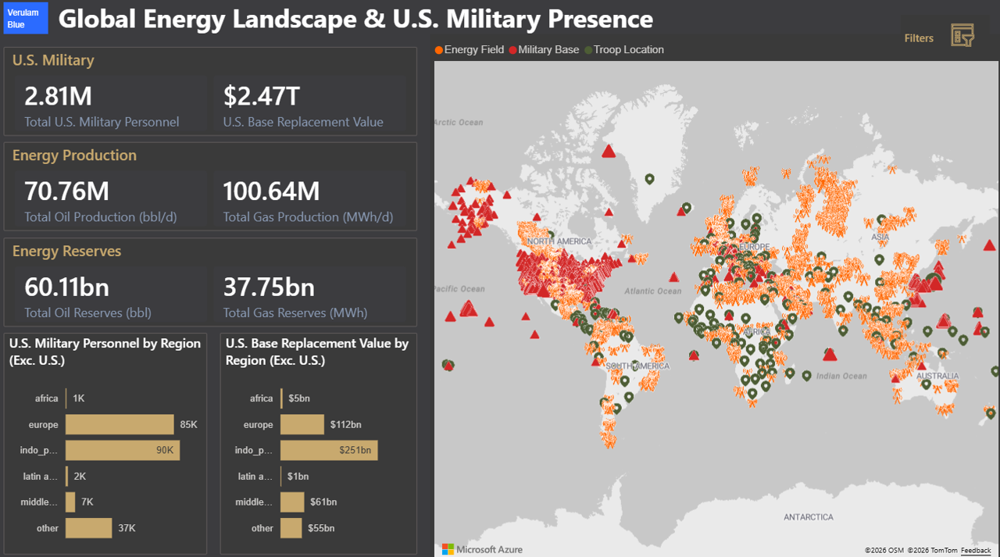

# Verulam Blue - Applied Strategic Analysis (Case Study)
## 2026 Iran War | Energy Disruption & U.S. Base Damage Exposures

     

> **A note on this report:** This is a scenario-based analytical case study produced using the Verulam Blue modelling framework. It integrates field-level oil and gas data from the Global Oil and Gas Extraction Tracker (March 2026) with publicly available U.S. military infrastructure and personnel datasets. All figures are scenario-based estimates of **gross economic loss and gross economic exposure**, derived from explicit, user-defined parameters. This analysis is not a forecast and does not attempt to predict conflict duration, escalation, or outcomes.

---

## Dashboard Preview

<p align="center">
  
</p>

<p align="center">
  
</p>

**[→ View the live dashboard on Verulam Blue](https://energy-risk.verulamblue.com/)**

---

## 1) Background

On 28 February 2026, the United States and Israel launched coordinated strikes against Iranian military and leadership targets, initiating the 2026 Iran war. The conflict raised a number of analytical questions around how gross economic exposure scales across energy infrastructure and U.S. military assets in the region under different conflict assumptions.

This project builds the analytical capability to explore those questions end-to-end. Five raw source datasets were ingested, cleaned, and canonically mapped through a dbt pipeline into two independent star schemas on Microsoft Fabric Warehouse. A Power BI semantic model with six What-If scenario parameters sits directly on top via Direct Lake, feeding an interactive executive dashboard. All figures are gross economic loss and gross economic exposure estimates - explicitly framed prior to adjustment for costs, substitution, market response, or recovery - and every dashboard metric is independently verifiable via SQL against the mart layer.

The analytical output addresses eight findings across price redistribution, infrastructure destruction, chokepoint closure, defence alignment, and escalation dynamics.

---

## 2) Deliverables

### Published tables (dbt mart layer)

| Table | Schema | Description |
|---|---|---|
| `dim_geography` | `military` | Conformed geography dimension shared across both military fact tables |
| `dim_site` | `military` | Military installation attributes with coordinates |
| `dim_branch` | `military` | Military branch and component category reference |
| `fact_base_inventory` | `military` | Site-level plant replacement values (BSR FY2025) |
| `fact_personnel_assignment` | `military` | Country/state-level personnel counts (DMDC Dec 2025) |
| `dim_energy_field` | `energy` | Oil and gas field dimension with geographic attributes |
| `dim_fuel_type` | `energy` | Fuel type reference shared across both energy fact tables |
| `dim_reserves_classification` | `energy` | Reserves classification reference (2P filtered) |
| `fact_energy_production` | `energy` | Field-level daily production volumes (million bbl/y, MWh/day) |
| `fact_energy_reserves` | `energy` | Field-level recoverable reserves (million bbl, MWh) |

### Dashboard
- **Tab 1 - Operational Picture:** global map of U.S. military bases, troop locations, and oil and gas fields with KPI cards and regional summaries
- **Tab 2 - Risk and Impact Analytics:** interactive scenario-based gross economic loss estimation with independent military and energy scope selectors, a reactive map, and six What-If sliders

### Documentation
- [`docs/data_dictionary.md`](./docs/data_dictionary.md) - full column-level definitions for all mart tables
- [`docs/physical_data_model.md`](./docs/physical_data_model.md) - schema design, grain statements, and relationship definitions
- [`docs/er_diagram.mermaid`](./docs/er_diagram.mermaid) - entity-relationship diagram for both star schemas
- [`docs/analytical_report.md`](./docs/analytical_report.md) - full analytical report with parameter settings for all eight findings

---

## 3) Repository Structure

```
├── source_data/
│   ├── bases_original/
│   │   └── converted_upload_to_Fabric_WH/
│   │       └── Base_Structure_Report_FY25_with_lat_lon_converted.csv
│   ├── troops_original/
│   │   └── converted_upload_to_Fabric_WH/
│   │       └── DMDC_Website_Location_Report_2512_converted.csv
│   └── global_energy_original/
│       └── converted_upload_to_Fabric_WH/
│           ├── Global_Oil_and_Gas_Extraction_Tracker_March_2026_field_level_main_converted.csv
│           ├── Global_Oil_and_Gas_Extraction_Tracker_March_2026_field_level_production_converted.csv
│           └── Global_Oil_and_Gas_Extraction_Tracker_March_2026_field_level_reserves_converted.csv
├── dbt_analytics/
│   ├── models/
│   │   ├── staging/
│   │   │   ├── 01_nulls/
│   │   │   │   ├── stg_us_bases.sql
│   │   │   │   ├── stg_us_troops.sql
│   │   │   │   ├── stg_gem_main.sql
│   │   │   │   ├── stg_gem_production.sql
│   │   │   │   └── stg_gem_reserves.sql
│   │   │   └── 02_standardised_txt/
│   │   │       ├── stg_us_bases_standardised_txt.sql
│   │   │       ├── stg_us_troops_standardised_txt.sql
│   │   │       ├── stg_gem_main_standardised_txt.sql
│   │   │       ├── stg_gem_production_standardised_txt.sql
│   │   │       └── stg_gem_reserves_standardised_txt.sql
│   │   ├── intermediate/
│   │   │   ├── 01_canonical_mapped/
│   │   │   │   ├── int_us_bases_mapped.sql
│   │   │   │   ├── int_us_troops_mapped.sql
│   │   │   │   ├── int_gem_fields_mapped.sql
│   │   │   │   ├── int_gem_production_mapped.sql
│   │   │   │   └── int_gem_reserves_mapped.sql
│   │   │   ├── 02_unit_normalisation/
│   │   │   │   ├── int_gem_production_enriched.sql
│   │   │   │   └── int_gem_reserves_enriched.sql
│   │   │   └── 03_region_mapped/
│   │   │       ├── int_us_bases_region_mapped.sql
│   │   │       ├── int_us_troops_region_mapped.sql
│   │   │       ├── int_gem_fields_region_mapped.sql
│   │   │       ├── int_gem_production_region_mapped.sql
│   │   │       └── int_gem_reserves_region_mapped.sql
│   │   └── marts/
│   │       ├── military/
│   │       │   ├── dim_geography.sql
│   │       │   ├── dim_site.sql
│   │       │   ├── dim_branch.sql
│   │       │   ├── fact_base_inventory.sql
│   │       │   └── fact_personnel_assignment.sql
│   │       ├── energy/
│   │       │   ├── dim_energy_field.sql
│   │       │   ├── dim_fuel_type.sql
│   │       │   ├── dim_reserves_classification.sql
│   │       │   ├── fact_energy_production.sql
│   │       │   └── fact_energy_reserves.sql
│   │       └── map/
│   │           └── map_locations.sql
│   ├── seeds/
│   │   └── mappings/
│   │       ├── map_geography.csv
│   │       ├── map_region.csv
│   │       ├── map_country_centroids.csv
│   │       ├── map_fuel_description.csv
│   │       └── map_reserves_classification.csv
│   ├── analyses/
│   │   ├── profiling.sql
│   │   └── profiling_post_staging.sql
│   └── docs/
│       ├── profiling_findings.md
│       └── profiling_post_staging_findings.md
├── assets/
│   └── dashboard_overview.gif
└── docs/
```

---

## 4) Executive Summary - Key Findings at a Glance

| Finding | Headline Result |
|---|---|
| **Price Redistribution** | The same price shock that costs China \$6.22bn net earns the USA \$72.44bn and Russia \$28.64bn - with no additional physical damage to either country |
| **Symmetric Escalation** | Under matched escalation severity, the GCC absorbs \$111.35bn in gross energy losses vs \$69.84bn for Iran - approximately 1.6× - due to greater production scale |
| **Dual Chokepoint Closure** | Simultaneous Hormuz and Red Sea closure multiplies gross exposure 4.4× over a Hormuz-only baseline, from \$22.29bn to \$97.20bn |
| **Defence Alignment Gap** | Saudi Arabia ranks first for energy exposure and last for U.S. military presence - a rank delta of −7. Oman has the highest exposure-to-military ratio at 103:1 |
| **Country Concentration** | Saudi Arabia (\$6.06bn) and Iran (\$6.05bn) are the two largest single-country energy exposures. Kuwait is the primary co-location risk |
| **Duration vs Intensity** | A 180-day moderate conflict (Scenario B, \$95bn) generates ~30% higher total exposure than a 45-day high-intensity conflict (Scenario A, \$73bn) |
| **Binding Escalation Lever** | Duration is the dominant single lever: extending conflict to 180 days produces \$63.51bn vs \$42.90bn for intensity escalation and \$38.94bn for price escalation |
| **\$1 Trillion Stress Case** | Trillion-scale exposure ($1.04T) requires simultaneous extreme assumptions across all parameters. Reserve impairment alone cannot reach this threshold |

**Baseline parameters (all scenario analysis):**

| Parameter | Value | Notes |
|---|---|---|
| Base Damage % | 20% | Moderate |
| Energy Output Destroyed % | 20% | Significant disruption |
| Conflict Duration (days) | 60 | Midpoint of DIA's assessed Hormuz closure range |
| Reserve Impairment % | 0.1% | Localised permanent damage |
| Oil Price ($/bbl) | \$70 | Pre-war reference |
| Gas Price ($/MWh) | \$35 | Pre-war reference |

---

## 5) Dataset & Key Fields

### 5.1 Source datasets

| Source | Description | Snapshot |
|---|---|---|
| DoD Base Structure Report FY2025 | U.S. base inventory with plant replacement values and coordinates | 30 Sep 2024 |
| DMDC Personnel Report | Defense Manpower Data Center personnel counts by country/state and branch | 31 Dec 2025 |
| GEM Main (field-level) | Global Oil and Gas Extraction Tracker - field identifiers, coordinates, country | March 2026 |
| GEM Production (field-level) | Production volumes at field level in source units | March 2026 |
| GEM Reserves (field-level) | Reserve volumes at field level; dashboard defaults to 2P (Proved + Probable) | March 2026 |

### 5.2 Data access

The raw source datasets used in this project are publicly available but are not redistributed in this repository.

- DoD Base Structure Report (FY2025) - U.S. Department of Defense
- DMDC Personnel Data - Defense Manpower Data Center
- Global Oil and Gas Extraction Tracker - Global Energy Monitor (March 2026 edition)

Users wishing to replicate the pipeline must download these directly from their respective sources and load them into Microsoft Fabric Warehouse before running the dbt models.

### 5.3 Geographic scope

**U.S. Military Presence filter:** Bahrain, Israel, Jordan, Kuwait, Oman, Qatar, Saudi Arabia, United Arab Emirates  
**Oil & Gas Assets filter:** Bahrain, Iran, Iraq, Israel, Kuwait, Qatar, Saudi Arabia, United Arab Emirates, Yemen

The Oil & Gas Assets filter intentionally includes Iran alongside Gulf Arab states to capture both sides of the conflict's energy exposure within a single scenario.

### 5.4 Unit conversions

| Fuel | Raw Source Unit | Standardised Unit | Conversion |
|---|---|---|---|
| Oil (production) | Million bbl/year | bbl/day | × 1,000,000 ÷ 365 |
| Gas (production) | Million m³/year | MWh/day | × 1,000,000 × 0.01056 ÷ 365 |
| Oil (reserves) | Various | million bbl | Normalised to million bbl |
| Gas (reserves) | Various | million bbl equivalent | Normalised to million bbl |

**Gas heating value assumption:** 38 MJ/m³ (1 MWh = 3.6 GJ → 38 ÷ 3.6 = 0.01056 MWh/m³)

---

## 6) Data Pipeline & Processing Approach

The pipeline runs across five stages from raw source ingestion through to the executive dashboard.

**Stage 1 - Data Ingestion**  
Five raw source files loaded into Microsoft Fabric Warehouse via Fabric Get Data. GEM source files must be loaded this way rather than via dbt seed due to a known incompatibility between dbt-fabric 1.9.8 and the Fabric Warehouse UTF-8 collation (Latin1_General_100_BIN2_UTF8), which causes failures on Unicode content including Arabic script field names. Direct upload via Fabric Get Data handles Unicode natively and avoids the ODBC encoding conflict.

> ⚠️ **Setup constraint:** GEM datasets must be loaded via Fabric Get Data, not dbt seed. Loading via dbt seed will fail on Unicode field names in the GEM source files.

**Stage 2 - Cleaning & Standardisation (dbt)**  
All datasets cleaned and canonically mapped using dbt-fabric 1.9.8:
- text standardisation and case normalisation
- geographic remapping and country/state canonical naming
- fuel type canonicalisation (Oil, Gas, NGL, Condensate, Oil and Gas)
- reserves classification normalisation including Cyrillic-to-Latin transliteration
- unit standardisation to bbl/day, MWh/day, bbl, and MWh

**Stage 3 - Star Schema Mart Layer (dbt)**  
Two independent star schemas deployed in the `military` and `energy` schemas within Fabric Warehouse. Ten dbt models covering all dimension and fact tables. Surrogate keys generated using `dbt_utils.generate_surrogate_key()` - deterministic hashes stored as NVARCHAR(32), stable across refreshes. Natural keys preserved alongside surrogates for full traceability.

**Stage 4 - Semantic Model (Power BI)**  
A Power BI semantic model constructed on Direct Lake on SQL, eliminating import latency and ensuring decision makers always view current data. Fifteen DAX measures across two tabs and six What-If parameters covering base damage, produced hydrocarbons physically destroyed, conflict duration, oil price, reserve impairment, and gas price. All value outputs are explicitly framed as gross economic loss or gross economic exposure, prior to adjustment for costs, substitution, market response, or recovery.

**Stage 5 - Executive Dashboard (Power BI)**  
A two-tab dashboard delivered via Power BI. All baseline metrics independently validated via direct SQL queries against the dbt mart layer and reconciled exactly.

### 6.1 Key design decisions

**Schema separation** - The military and energy schemas share no SQL joins. Cross-schema analysis is performed exclusively at the dashboard query layer through filtered independent aggregations. This is intentional and enforced at the model level. See [Key Design Insight](#10-key-design-insight) below.

**Financial precision** - `DECIMAL(18,2)` used for plant replacement values. `FLOAT` is not used for financial loss calculations due to rounding errors. All other measures use `DECIMAL(18,4)` to preserve source precision.

**Reserves classification** - The dashboard filters exclusively to 2P (Proved + Probable) reserves to prevent double-counting across classification schemes. Summing across 1P, 2P, and 3P would materially overstate reserves.

**Exclusions from value calculations** - BOE fields, mixed fuel fields without separate oil/gas attribution, and unknown fuel types are excluded due to pricing ambiguity. Estimated impact: 5–10% of total gross value excluded; figures are therefore conservative lower bounds.

**NULL handling** - NULLs accepted for optional attributes. No default unknown values substituted. `classification_desc` in `dim_reserves_classification` is NULL where the coding scheme cannot be identified from source data.

**Known analytical constraint** - `fact_base_inventory` is at site level (multiple rows per country/state). `fact_personnel_assignment` is at country/state level. Cross-table joins require aggregating base inventory to country/state level first. This aggregation is handled at query time, not in the model.

---

## 7) Data Quality & Testing

dbt tests cover all mart models and must pass before dashboard validation is run.

- **Primary key uniqueness** on all dimension and fact tables
- **Not-null constraints** on all foreign keys
- **Accepted values tests** for fuel type, reserves classification, and component category fields
- **Referential integrity** between all fact and dimension tables

```bash
dbt test
```

All tests must return zero failures before proceeding to Power BI validation. All baseline dashboard metrics are independently reconciled against the mart layer via direct SQL — validation queries are not included in this repository.

---

## 8) Star Schema - Model Reference

### Military schema

```
military.dim_geography (conformed)
  ├── military.fact_base_inventory   [site_key → dim_site, geo_key]
  └── military.fact_personnel_assignment   [geo_key, branch_key → dim_branch]

military.dim_site  [geo_key → dim_geography]
military.dim_branch
```

### Energy schema

```
energy.dim_energy_field
  ├── energy.fact_energy_production   [field_key, fuel_key → dim_fuel_type]
  └── energy.fact_energy_reserves     [field_key, fuel_key, classification_key → dim_reserves_classification]

energy.dim_fuel_type
energy.dim_reserves_classification
```

### Grain statements

| Model | Grain |
|---|---|
| `fact_base_inventory` | One row per military installation site per snapshot date |
| `fact_personnel_assignment` | One row per country/state per branch per component category per snapshot date |
| `fact_energy_production` | One row per energy field per fuel description per data year |
| `fact_energy_reserves` | One row per energy field per fuel description per reserves classification per data year |

---

## 9) DAX Measures & Scenario Parameters

### Scenario parameters (What-If sliders)

| Parameter | Range | Baseline | Description |
|---|---|---|---|
| Base Damage % | 0–100% | 20% | Percentage of U.S. base replacement value damaged |
| Energy Output Destroyed % | 0–100% | 20% | Percentage of daily production physically destroyed |
| Conflict Duration | 1–365 days | 60 | Duration of production disruption |
| Reserve Impairment % | 0–100% | 0.1% | Percentage of total reserves permanently lost |
| Oil Price | \$0–\$200/bbl | \$70 | Reference price for oil valuation |
| Gas Price | \$0–\$200/MWh | \$35 | Reference price for gas valuation |

### Tab 1 — Operational Picture (5 measures)

**U.S. Base Replacement Value**
```dax
U.S. Base Replacement Value =
SUM('dbt_dev_mart fact_base_inventory'[plant_replacement_value_m]) * 1000000
```

**Total Oil Production (bbl/d)**
```dax
Total Oil Production (bbl/d) =
CALCULATE(
    SUM('dbt_dev_mart fact_energy_production'[quantity_standardised]),
    'dbt_dev_mart fact_energy_production'[units_standardised] = "bbl/day",
    'dbt_dev_mart fact_energy_production'[fuel_description_canonical_mapped] = "oil"
)
```

**Total Gas Production (MWh/d)**
```dax
Total Gas Production (MWh/d) =
CALCULATE(
    SUM('dbt_dev_mart fact_energy_production'[quantity_standardised]),
    'dbt_dev_mart fact_energy_production'[units_standardised] = "MWh/day",
    'dbt_dev_mart fact_energy_production'[fuel_description_canonical_mapped] = "gas"
)
```

**Total Oil Reserves (bbl)**
```dax
Total Oil Reserves (bbl) =
CALCULATE(
    SUM('dbt_dev_mart fact_energy_reserves'[quantity_standardised]),
    'dbt_dev_mart fact_energy_reserves'[units_standardised] = "bbl",
    'dbt_dev_mart fact_energy_reserves'[fuel_description_canonical_mapped] = "oil",
    'dbt_dev_mart dim_reserves_classification'[reserves_classification] = "2p reserves"
)
```

**Total Gas Reserves (MWh)**
```dax
Total Gas Reserves (MWh) =
CALCULATE(
    SUM('dbt_dev_mart fact_energy_reserves'[quantity_standardised]),
    'dbt_dev_mart fact_energy_reserves'[units_standardised] = "MWh",
    'dbt_dev_mart fact_energy_reserves'[fuel_description_canonical_mapped] = "gas",
    'dbt_dev_mart dim_reserves_classification'[reserves_classification] = "2p reserves"
)
```

### Tab 2 — Risk and Impact Analytics (10 measures)

**Gross Damage-Related Base Costs**
```dax
Gross Damage-Related Base Costs =
SUM('dbt_dev_mart fact_base_inventory'[plant_replacement_value_m])
    * [Base Damage % Value] * 1000000
```

**Oil Output Destroyed (bbl/day)**
```dax
Oil Output Destroyed (bbl/day) =
CALCULATE(
    SUM('dbt_dev_mart fact_energy_production'[quantity_standardised])
        * [Output Destroyed % Value],
    'dbt_dev_mart fact_energy_production'[units_standardised] = "bbl/day",
    'dbt_dev_mart fact_energy_production'[fuel_description_canonical_mapped] = "oil"
)
```

**Gas Output Destroyed (MWh/day)**
```dax
Gas Output Destroyed (MWh/day) =
CALCULATE(
    SUM('dbt_dev_mart fact_energy_production'[quantity_standardised])
        * [Output Destroyed % Value],
    'dbt_dev_mart fact_energy_production'[units_standardised] = "MWh/day",
    'dbt_dev_mart fact_energy_production'[fuel_description_canonical_mapped] = "gas"
)
```

**Oil Destroyed Value (Gross)**
```dax
Oil Destroyed Value (Gross) =
[Oil Output Destroyed (bbl/day)] * [Days of Destruction Value] * [Oil Price ($/bbl) Value]
```

**Gas Destroyed Value (Gross)**
```dax
Gas Destroyed Value (Gross) =
[Gas Output Destroyed (MWh/day)] * [Days of Destruction Value] * [Gas Price ($/MWh) Value]
```

**Oil Reserves Impaired (bbl)**
```dax
Oil Reserves Impaired (bbl) =
CALCULATE(
    SUM('dbt_dev_mart fact_energy_reserves'[quantity_standardised])
        * [Reserve Impairment % Value],
    'dbt_dev_mart fact_energy_reserves'[units_standardised] = "bbl",
    'dbt_dev_mart fact_energy_reserves'[fuel_description_canonical_mapped] = "oil",
    'dbt_dev_mart dim_reserves_classification'[reserves_classification] = "2p reserves"
)
```

**Gas Reserves Impaired (MWh)**
```dax
Gas Reserves Impaired (MWh) =
CALCULATE(
    SUM('dbt_dev_mart fact_energy_reserves'[quantity_standardised])
        * [Reserve Impairment % Value],
    'dbt_dev_mart fact_energy_reserves'[units_standardised] = "MWh",
    'dbt_dev_mart fact_energy_reserves'[fuel_description_canonical_mapped] = "gas",
    'dbt_dev_mart dim_reserves_classification'[reserves_classification] = "2p reserves"
)
```

**Oil Reserve Exposure (Gross)**
```dax
Oil Reserve Exposure (Gross) =
[Oil Reserves Impaired (bbl)] * [Oil Price ($/bbl) Value]
```

**Gas Reserve Exposure (Gross)**
```dax
Gas Reserve Exposure (Gross) =
[Gas Reserves Impaired (MWh)] * [Gas Price ($/MWh) Value]
```

**Gross Energy Loss & Exposure**
```dax
Gross Energy Loss & Exposure =
    [Oil Destroyed Value (Gross)]
    + [Gas Destroyed Value (Gross)]
    + [Oil Reserve Exposure (Gross)]
    + [Gas Reserve Exposure (Gross)]
```

> **Important:** The model is linear by construction. Every variable acts independently, scales linearly, and has no thresholds, feedbacks, or state dependence. The analytical value in this project derives from findings that test combinations, reveal structural asymmetry, and isolate which escalation levers bind - not from behavioural dynamics within the model itself.

---

## 10) Key Design Insight

This model intentionally avoids joining the military and energy schemas at the SQL layer. The two star schemas share no keys and are never directly joined in dbt.

All cross-domain analysis - bases near energy fields, troops in the same country as selected fields, exposure-to-military ratios - is performed at the semantic layer in Power BI, by filtering each schema independently and combining results in the presentation layer.

This separation is deliberate: the two schemas have different grains, different snapshot cadences, and different source structures. Forcing a SQL join would require artificial aggregations that introduce ambiguity and mask the independence of the underlying data. Keeping the join at the semantic layer preserves analytical flexibility and prevents false precision - which matters especially in a geopolitical modelling context where the uncertainty in the inputs already requires careful handling.

---

## 11) Analytical Findings

### Finding 1 - Who Benefits from Disruption Without Bearing Physical Damage?

Isolates price-driven windfall gains among major producers with minimal physical destruction. All physical damage parameters are held constant - only energy prices change, reflecting pre-conflict versus current market levels.

| Metric | USA | Russia | China |
|---|---|---|---|
| Oil Windfall (60 days) | \$24.22bn | \$10.93bn | \$5.52bn |
| Gas Windfall (60 days) | \$48.22bn | \$17.71bn | \$7.34bn |
| Import Cost (60 days) | N/A | N/A | −\$19.08bn |
| **Net Position** | **+\$72.44bn** | **+\$28.64bn** | **−\$6.22bn** |

The USA captures \$72.44bn primarily via its dominant gas production position. Russia collects \$28.64bn with zero conflict exposure. China is the net loser: a \$12.86bn domestic windfall is outweighed by a \$19.08bn import burden. Energy price shocks redistribute economic impact according to whether a country produces or consumes - not according to who is in the conflict.

---

### Finding 2 - Symmetric Infrastructure Destruction: Iran vs GCC

Models worst-case retaliatory escalation under symmetric severity to assess relative gross economic exposure. Parameters: 50% output destroyed, 180 days, \$90/bbl, \$65/MWh.

| Metric | Escalation Iran | Escalation GCC | Escalation Israel |
|---|---|---|---|
| Total Energy Exposure (Gross) | \$69.84bn | \$111.35bn | \$4.23bn |
| U.S. Base Damage Costs (Gross) | N/A | \$27.52bn | \$44.43M |
| Oil Destroyed Value | \$32.61bn | \$78.45bn | \$0 |
| Gas Destroyed Value | \$37.23bn | \$27.02bn | \$4.05bn |

The GCC bears approximately 1.6× Iran's losses under symmetric escalation - not due to disproportionate severity, but due to greater production scale and price amplification. Rhetoric around mutual "obliteration" masks a structural economic imbalance: the side with the largest export-oriented energy system stands to lose more under sustained infrastructure warfare.

---

### Finding 3 - Dual Chokepoint Closure: Strait of Hormuz and Red Sea

Models the combined effect of simultaneous maritime chokepoint closures - Hormuz (Iran conflict) and Red Sea (Houthi extension). These are not independent events in this scenario.

| Metric | Hormuz Only | Dual Chokepoint | Incremental Impact |
|---|---|---|---|
| Total Energy Exposure (Gross) | \$22.29bn | \$97.20bn | +\$74.91bn |
| Oil Destroyed Value | \$15.59bn | \$66.81bn | +\$51.22bn |
| Gas Destroyed Value | \$5.02bn | \$27.97bn | +\$22.95bn |
| Oil Output Destroyed (bbl/day) | 3.71M | 7.42M | +3.71M |

A Red Sea closure adds \$74.91bn of incremental gross exposure - a 4.4× increase over Hormuz-only. Output destruction rates double, but total destroyed values increase by more than threefold, reflecting the compounding effect of higher prices, greater destruction intensity, and extended disruption duration.

---

### Finding 4 & 5 - Defence Alignment Gap and Country Concentration

Tests alignment between gross energy loss and U.S. military replacement value; identifies where energy assets and military infrastructure are co-located.

| Country | Energy Rank | Military Rank | Rank Delta | Exposure/Military Ratio |
|---|---|---|---|---|
| Saudi Arabia | 1 | 8 | −7 | N/A (no public military data) |
| Oman | 4 | 7 | −3 | 103.29 |
| UAE | 3 | 4 | −1 | 9.57 |
| Qatar | 2 | 2 | 0 | 1.68 |
| Kuwait | 5 | 1 | +4 | 0.12 |
| Bahrain | 7 | 3 | +4 | 0.20 |

Oman exhibits the most severe calculable alignment gap at 103:1 - over \$103 of gross energy exposure for every \$1 of U.S. military replacement value. Kuwait and Bahrain are the exceptions where military presence materially exceeds energy exposure for strategic reasons. Saudi Arabia's rank delta reflects a data limitation (no publicly disclosed base replacement values) rather than an actual absence of U.S. presence.

---

### Finding 6 - Duration vs Intensity Trade-offs

Compares a short, high-intensity conflict against a longer-duration, moderate disruption to assess which generates greater cumulative gross exposure.

| Metric | Scenario A (45 days, 50% destruction) | Scenario B (180 days, 20% destruction) |
|---|---|---|
| Total Energy Exposure (Gross) | \$73.37bn | \$95.04bn |
| Oil Destroyed Value | \$50.11bn | \$66.81bn |
| Gas Destroyed Value | \$17.48bn | \$25.82bn |
| Oil Reserve Exposure | \$5.67bn | \$2.36bn |

Scenario B produces ~30% higher total gross exposure than Scenario A despite substantially lower daily destruction intensity. Duration and price persistence dominate cumulative impact. Higher intensity increases daily losses but does not guarantee higher total damage.

---

### Finding 7 - Which Escalation Lever Becomes Binding?

Isolates each single escalation dimension by holding all others at baseline values. The single-variable design rules out interaction effects.

| Lever | Total Gross Exposure |
|---|---|
| Baseline | \$22.29bn |
| Duration (60 → 180 days) | \$63.51bn |
| Intensity (20% → 40% destruction) | \$42.90bn |
| Price ($70 → \$120/bbl, \$35 → \$65/MWh) | \$38.94bn |

Duration is the most efficient escalation lever - nearly 3× the baseline and materially higher than either price or intensity escalation at these parameter levels. Strategic economic risk depends less on how destructive a conflict becomes on any given day, and more on how long energy markets remain disrupted.

---

### Finding 8 - Under What Conditions Does Gross Exposure Exceed \$1 Trillion?

Tests minimum severity combinations that generate trillion-dollar scale gross exposure. \$1 trillion is used as a gross economic stress marker, not an estimate of realised damage.

| Test | Reserve Impairment | Other Parameters | Total Exposure | Exceeds \$1T? |
|---|---|---|---|---|
| A | 0.1% | Baseline | \$22.29bn | No |
| B | 0.5% | Baseline | \$29.03bn | No |
| C | 1.0% | Baseline | \$37.46bn | No |
| D | 2.0% | Baseline | \$54.31bn | No |
| **E** | **2.9% (max)** | **50% destruction, 365 days, \$200/bbl, \$100/MWh** | **\$1.04T** | **Yes** |

Trillion-scale exposure requires simultaneous extreme assumptions across all parameters. Reserve impairment alone - even at the model maximum of 2.9% - cannot reach the threshold. Destroyed production value (\$895.51bn) accounts for the majority of exposure in the stress case; reserve impairment (\$139.62bn) is significant but secondary. The \$1T outcome should be treated as a theoretical upper-bound stress case, not a central scenario.

---

## 12) Tech Stack

| Component | Detail |
|---|---|
| Platform | Microsoft Fabric Warehouse |
| Transformation | dbt-fabric 1.9.8 \| dbt 1.11.7 |
| Dialect | T-SQL |
| Surrogate keys | `dbt_utils.generate_surrogate_key()` |
| Semantic model | Power BI Direct Lake on SQL — 15 DAX measures across 2 tabs |
| Dashboard | VBM_Energy_Disruption_and_Base_Damage_Assessment_Dashboard |
| Validation | All baseline metrics reconciled exactly via SQL against mart layer |
| Report generated | 26 March 2026 |

---

## 13) Assumptions & Limitations

| Limitation | Detail |
|---|---|
| Data coverage | Mixed hydrocarbon streams excluded; figures are conservative lower bounds of gross exposure |
| Parameter uncertainty | Damage and duration assumptions are judgement-based |
| Military scope | Plant replacement value only; not total military cost. Saudi Arabia records zero by design (no publicly disclosed figures) |
| Price basis | Pre-war prices ($70/bbl, \$35/MWh) isolate gross physical loss from price shock amplification. Current market prices are materially higher |
| Non-additivity | Production loss and reserve exposure represent different time horizons and must not be summed as a single realised loss figure |
| Iran reserve data | Iran reserve impairment modelled at zero by design; total Iranian losses may be understated |
| Conflict duration | 60-day baseline reflects the midpoint of the DIA's assessed Hormuz closure range of one to six months |
| Model linearity | The scenario calculator is linear by construction. No thresholds, feedbacks, or state dependence. Single-variable stress tests confirm only that more of X produces proportionally more Y |
| Dataset boundaries | An anonymised, bounded dataset designed to be realistic. Results should not be treated as benchmarking or representative of all providers |

---

## 14) Authorship & Scope

This report is an independent analytical case study produced by **Matthew Barr of Verulam Blue**. It is presented as a demonstration of end-to-end analytics engineering on the Microsoft Fabric platform, spanning data transformation (including dbt-based pipelines), scenario modelling, and analytical interpretation using DAX and Power BI, based on publicly available information.

The analysis reflects the author's analytical framework and assumptions only. It does not represent the views of any government, military, defence organisation, or public authority, and no affiliation with any such body is claimed or implied. The scenarios presented are illustrative stress cases intended to explore scale, structure, and sensitivity. They should not be interpreted as forecasts, intelligence assessments, or policy recommendations.

---

## Contact & Enquiries

This project is part of **Verulam Blue Mint** - a browser-based platform for practising and assessing real-world data skills on messy, production-style datasets.

Verulam Blue Mint focuses on:

- **End-to-end pipelines, not toy examples** - SQL, dbt, and PySpark workflows built around realistic data quality issues, business rules, and KPI outputs
- **Auto-validated tasks and KPIs** - results checked against reference outputs for fast feedback and repeatability
- **Portfolio-ready projects** - work that is credible as a GitHub case study and interview story

**For consultancy enquiries, platform access, or to discuss similar geopolitical risk or operational analytics projects, please visit:**

[](https://www.verulamblue.com)
[](mailto:vbm@verulamblue.com)

<p>
  
</p>

